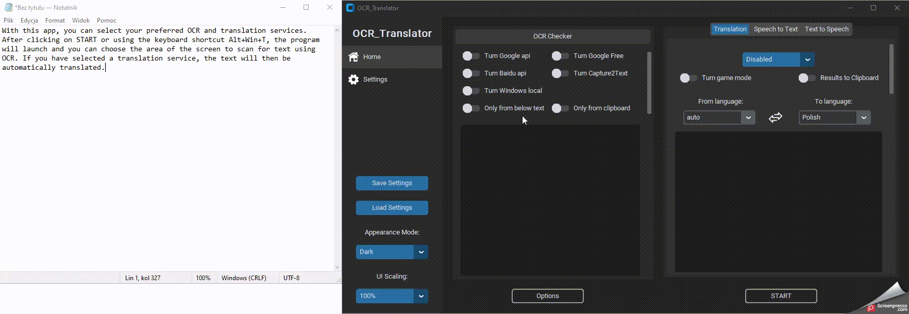

  <h1 align="center">OCR Translator</h1>
  
<i>Convert captured images into text and then translate that text.</i>

   
  

---
With this app, you can select your preferred OCR and translation services. After clicking on START or using the keyboard shortcut Alt+Win+T, the program will launch and you can choose the area of the screen to scan for text using OCR. If you have selected a translation service, the text will then be automatically translated.

preview:

---
### Dependency
1. [Python 3.9](https://www.python.org/downloads/release/python-390/).
2. (optional) [Capture2Text](https://sourceforge.net/projects/capture2text/).
3. (optional) [Tesseract](https://github.com/UB-Mannheim/tesseract/wiki).
4. (optional) Google api generate a [service_account_creds.json](https://developers.google.com/workspace/guides/create-credentials). Then, put file into the 'ocrTranslate/configs' directory.
5. 

### (optional) ChatGPT
> #### [Source](https://github.com/acheong08/ChatGPT)

## Configuration
1. Create account on [OpenAI's ChatGPT](https://chat.openai.com/)
2. Save your email and password
### Authentication method: (Choose 1 and paste to app settings)
#### - Email/Password
Not supported for Google/Microsoft accounts
#### - Session token
1. Login in to https://chat.openai.com
2. Open the console in Google Chrome -> Application -> Storage -> Cookies -> https://chat.openai.com -> Get the value from __Secure-next-auth.session-token
#### - Access token
https://chat.openai.com/api/auth/session

---

### Supported OCR Services

| ID  | OCR                                                                                                   | Online/Offline | Status |
|-----|-------------------------------------------------------------------------------------------------------|----------------|--------|
| 1   | [Google Vision Api](https://cloud.google.com/vision/docs/ocr)                                         | Online         | /      |
| 2   | [Google Vision Free Demo](https://cloud.google.com/vision/docs/drag-and-drop)                         | Online         | stable |
| 3   | [Windows OCR](https://learn.microsoft.com/en-us/uwp/api/windows.media.ocr.ocrengine?view=winrt-22621) | Offline        | stable |
| 4   | [Capture2Text](https://capture2text.sourceforge.net/)                                                 | Offline        | stable |
| 5   | [Baidu Api](https://intl.cloud.baidu.com/product/ocr.html)                                            | Online         | stable |

### Supported Translation Services
> #### [Source](https://github.com/uliontse/translators)

| ID  | Translator                                                    | Number of Supported Languages | Advantage                                                                                   | Service                                                                                                | Status                          |
|-----|---------------------------------------------------------------|-------------------------------|---------------------------------------------------------------------------------------------|--------------------------------------------------------------------------------------------------------|---------------------------------|
| 1   | [Niutrans](https://niutrans.com/trans)                        | 302                           | support the most languages in the world                                                     | [Northeastern University](http://english.neu.edu.cn/) / [Niutrans](https://github.com/NiuTrans), China | /                               |
| 2   | [Alibaba](https://translate.alibaba.com)                      | 221                           | support most languages, support professional field                                          | [Alibaba](https://damo.alibaba.com/about?lang=en), China                                               | stable                          |
| 3   | [Baidu](https://fanyi.baidu.com)                              | 201                           | support most languages, support professional field, support Classical Chinese               | [Baidu](https://ir.baidu.com/company-overview), China                                                  | stable                          |
| 4   | [Iciba](https://www.iciba.com/fy)                             | 187                           | support the most languages in the world                                                     | [Kingsoft](https://www.wps.com/about-us/) / [Xiaomi](https://www.mi.com/us/about/), China              | stable                          |
| 5   | [MyMemory](https://mymemory.translated.net)                   | 151                           | support the most languages in the world, good at Creole English, Creole French              | [Translated](https://translatedlabs.com/welcome), Italy                                                | stable                          |
| 6   | [Iflytek](https://fanyi.xfyun.cn/console/trans/text)          | 140                           | support the most languages in the world                                                     | [Iflytek](https://www.iflytek.com/en/about-us.html), China                                             | /                               |
| 7   | [Google](https://translate.google.com)                        | 134                           | support more languages in the world                                                         | [Google](https://about.google/), America                                                               | stable(offline in China inland) |
| 8   | [VolcEngine](https://translate.volcengine.com)                | 122                           | support more languages in the world, support professional field                             | [ByteDance](https://www.bytedance.com/en/), China                                                      | /                               |
| 9   | [Lingvanex](https://lingvanex.com/demo)                       | 112                           | support translation of different regions but the same language                              | [Lingvanex](https://lingvanex.com/about-us/), Cyprus                                                   | stable                          |
| 10  | [Bing](https://www.bing.com/Translator)                       | 110                           | support more languages in the world                                                         | [Microsoft](https://www.microsoft.com/en-us/about), America                                            | stable                          |
| 11  | [Yandex](https://translate.yandex.com)                        | 102                           | support more languages in the world, support word to emoji                                  | [Yandex](https://yandex.com/company/), Russia                                                          | /                               |
| 12  | [Itranslate](https://itranslate.com/webapp)                   | 101                           | support translation of different regions but the same language, such as en-US, en-UK, en-AU | [Itranslate](https://itranslate.com/about), Austria                                                    | stable                          |
| 13  | [Sogou](https://fanyi.sogou.com)                              | 61                            | support more languages in the world                                                         | [Tencent](https://www.tencent.com/en-us/about.html), China                                             | stable                          |
| 14  | [ModernMt](https://www.modernmt.com/translate)                | 56                            | open-source, support more languages in the world                                            | [Modernmt](https://github.com/modernmt) / [Translated](https://translatedlabs.com/welcome), Italy      | stable                          |
| 15  | [Reverso](https://www.reverso.net/text-translation)           | 42                            | popular on Mac and Iphone                                                                   | [Reverso](https://www.corporate-translation.reverso.com/about-us), France                              | stable                          |
| 16  | [Deepl](https://www.deepl.com/translator)                     | 27                            | high quality to translate but response slowly                                               | [Deepl](https://jobs.deepl.com/l/en), Germany                                                          | stable                          |
| 17  | [QQTranSmart](https://transmart.qq.com)                       | 22                            | support main languages                                                                      | [Tencent](https://www.tencent.com/en-us/about.html), China                                             | stable                          |
| 18  | [TranslateCom](https://www.translate.com/machine-translation) | 21                            | good at English translation                                                                 | [TranslateCom](https://www.translate.com/about-us), America                                            | stable                          |
| 19  | [QQFanyi](https://fanyi.qq.com)                               | 17                            | support main languages                                                                      | [Tencent](https://www.tencent.com/en-us/about.html), China                                             | stable                          |
| 20  | [Argos](https://translate.argosopentech.com)                  | 17                            | open-source                                                                                 | [Argos](https://github.com/argosopentech) / [Libre](https://github.com/LibreTranslate), America        | stable                          |
| 21  | [Youdao](https://ai.youdao.com/product-fanyi-text.s)          | 15                            | support main languages, high quality                                                        | [Netease](https://ir.netease.com/company-overview/corporate-profile), China                            | stable                          |
| 22  | [Papago](https://papago.naver.com)                            | 15                            | good at Korean translation                                                                  | [Naver](https://www.navercorp.com/en/naver/company), South Korea                                       | stable                          |
| 23  | [Iflyrec](https://fanyi.iflyrec.com)                          | 12                            | good at Chinese translation                                                                 | [Iflytek](https://www.iflytek.com/en/about-us.html), China                                             | stable                          |
| 24  | [Caiyun](https://fanyi.caiyunapp.com)                         | 7                             | high quality to translate but response slowly, support professional field                   | [ColorfulClouds](http://caiyunapp.com/jobs/), China                                                    | stable                          |
| 25  | [Mglip](http://fy.mglip.com/pc)                               | 3                             | good at Mongolia translation                                                                | [Inner Mongolia University](https://www.imu.edu.cn/yw/Home.htm), China                                 | stable                          |
| 26  | [Utibet](http://mt.utibet.edu.cn/mt)                          | 2                             | good at Tibet translation                                                                   | [Tibet University](http://www.utibet.edu.cn/), China                                                   |                                 |

---
