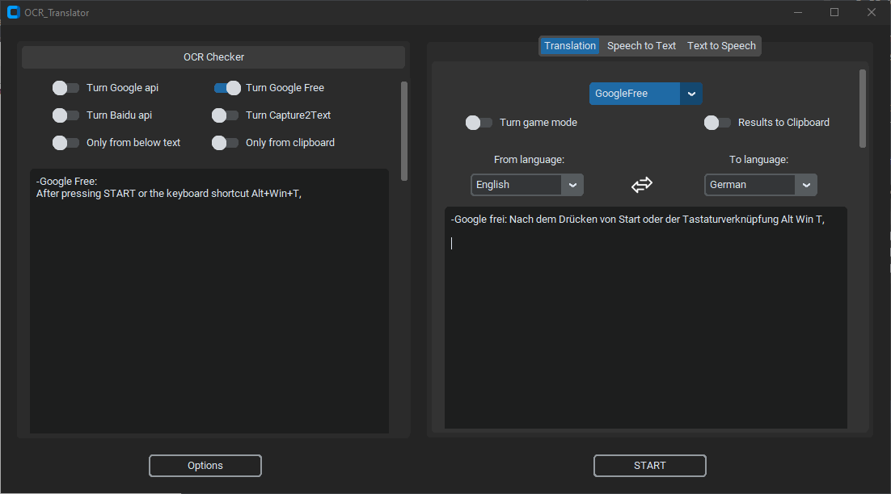

<p align="center">
  <h1 align="center">OCR Translator</h1>
  <p align="center">Convert Capture Image To Text and translate</p>
</p>

<p align="center">
  <a href="https://github.com/Azornes/ocrTranslator">
    
   </a>
</p>


Convert Capture Image To Text (with BaiduOCR, GoogleOCR, Capture2Text) and
translate this text (with Google, Chatgpt, DeepL).
---
Using this app, you can choose the OCR and translation services you would like to use. After pressing START or the keyboard shortcut Alt+Win+T, the program will launch and you can select the area of the screen you're interested in detecting text with OCR. Then, if a translation service was selected, the text will be translated.

preview:

example:

---
### Dependency
1. [Python 3.9](https://www.python.org/downloads/release/python-390/).
2. [Capture2Text](https://sourceforge.net/projects/capture2text/).

to working you need create config.ini and generate [service_account_creds.json](https://developers.google.com/workspace/guides/create-credentials?hl=pl).
And put this files to "ocrTranslate/configs"
### What does an example config.ini look like
```
[ChatGPT]
ApiKey = your_ApiKey
session_token = "your_session_token"
email = your_email
password = your_password

[Baidu]
AppId = your_appid
ApiKey = your_ApiKey
SecretKey = your_SecretKey

[Capture2Text]
path_to_Capture2Text_CLI_exe = C:\Program Files\Capture2Text\Capture2Text_CLI.exe
```

at this moment only supported chatgpt identification by email and password.

### how to get session token to chatgpt free (WIP)
1. Login to https://chat.openai.com
2. Open Console in your google chrome -> Application -> Storage -> Cookies -> https://chat.openai.com -> Value from __Secure-next-auth.session-token
