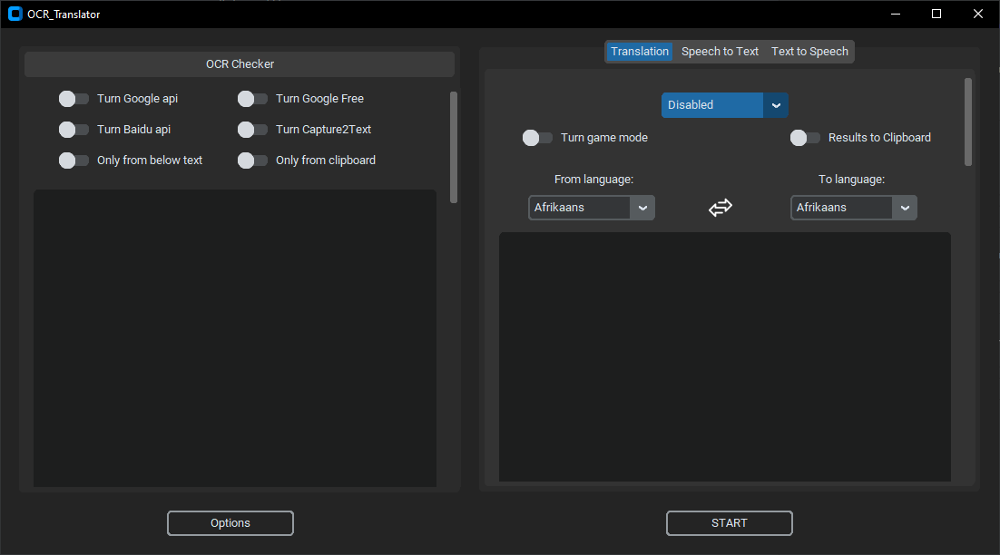

<p align="center">
  <h1 align="center">OCR Translator</h1>
  <p align="center">Convert captured images into text and then translate that text.</p>
</p>

<p align="center">
  <a href="https://github.com/Azornes/ocrTranslator">
    
   </a>
</p>


Convert captured images to text using BaiduOCR, GoogleOCR, or Capture2Text, and translate the resulting text using Google, Chatgpt, or DeepL.
---
With this app, you can select your preferred OCR and translation services. After clicking on START or using the keyboard shortcut Alt+Win+T, the program will launch and you can choose the area of the screen to scan for text using OCR. If you have selected a translation service, the text will then be automatically translated.

preview:

example:

---
### Dependency
1. [Python 3.9](https://www.python.org/downloads/release/python-390/).
2. [Capture2Text](https://sourceforge.net/projects/capture2text/).

To get it working, you need to create a config.ini file and generate a [service_account_creds.json](https://developers.google.com/workspace/guides/create-credentials?hl=pl).
Then, put both of these files into the 'ocrTranslate/configs' directory.
### What does an example config.ini look like
```
[ChatGPT]
ApiKey = your_ApiKey
session_token = "your_session_token"
email = your_email
password = your_password

[Baidu]
AppId = your_appid
ApiKey = your_ApiKey
SecretKey = your_SecretKey

[Capture2Text]
path_to_Capture2Text_CLI_exe = C:\Program Files\Capture2Text\Capture2Text_CLI.exe
```

at this moment only supported chatgpt identification by email and password.

### How to get session token for ChatGPT Free (WIP)
1. Login in to https://chat.openai.com
2. Open the console in Google Chrome -> Application -> Storage -> Cookies -> https://chat.openai.com -> Get the value from __Secure-next-auth.session-token
